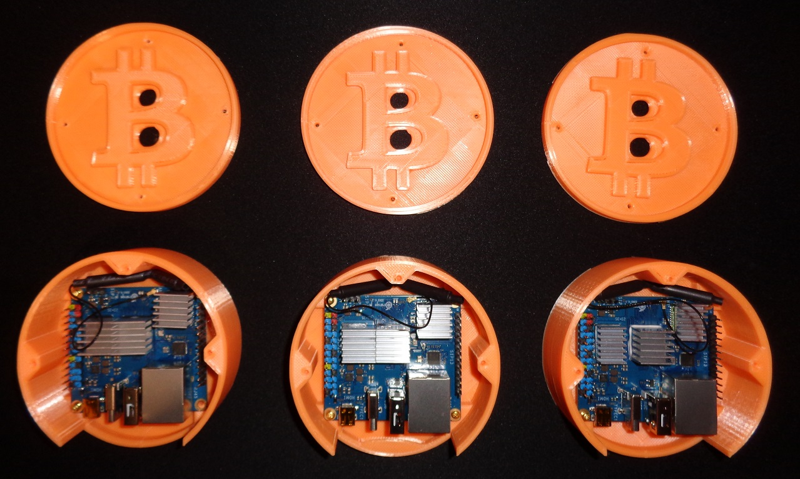
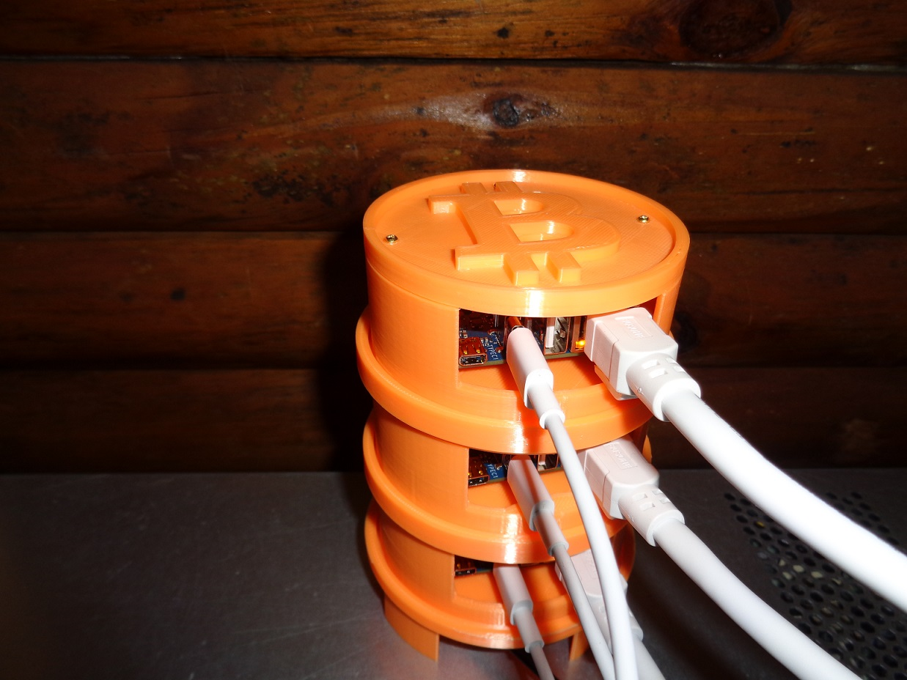

# bitty

- Bitty Bitcoin Miner is a low power-consuming miner based on the Orange Pi Zero 3 with cpuminer. Running at 5V and 3A, this little device makes for a very power-efficient miner and fun project. 
- Running headless custom Linux kernel and cpuminer.

